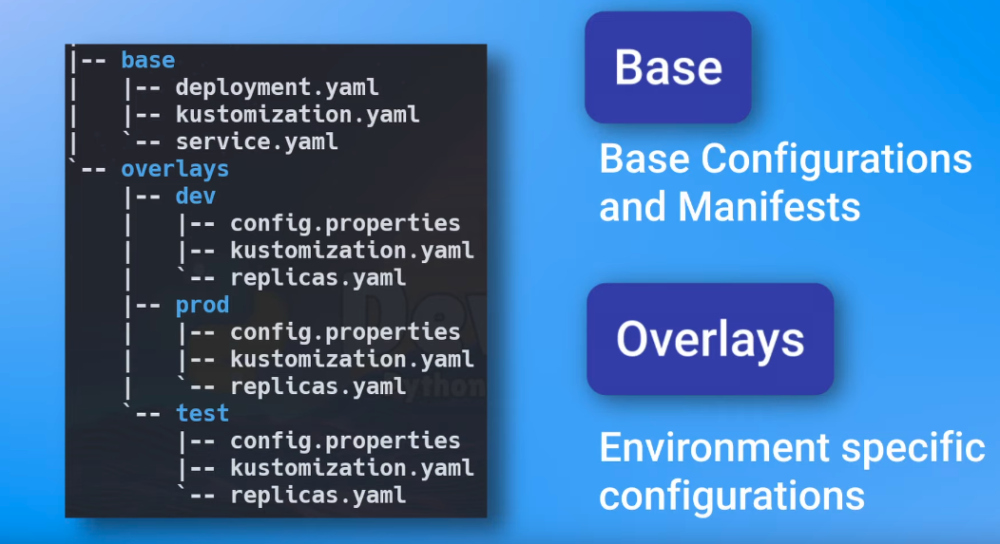
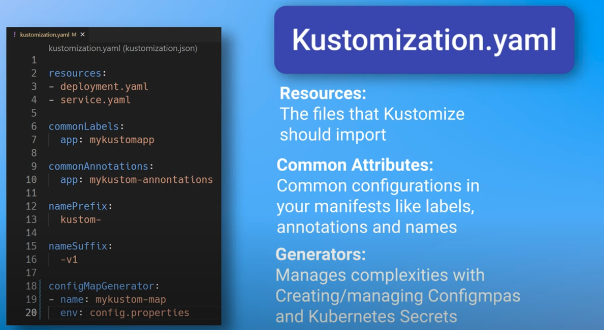
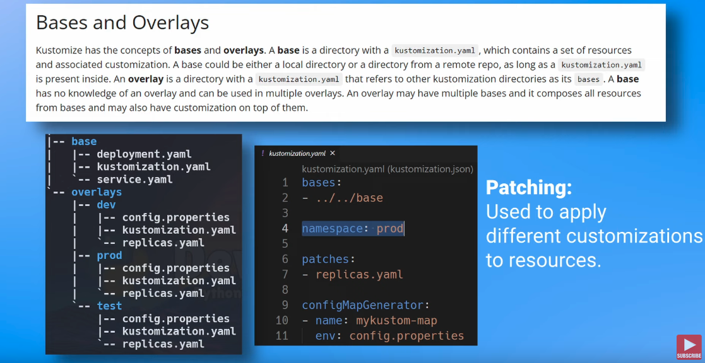

- K8s native tool for customizing K8s manifest files that doesn't require any complex templating or additional tools
- It uses a yaml files
- It simplifies configurations
- It allows you to easily override elements in manifest files for your each environments using a concept known as patching and overlays
- Easy to use comparing to helm

- With Kustomize we define which manifests to use and we provide common attributes to use. For example: labels, annotations and names
- At the end of the kustomization.yml we use generators which we can define configmaps/secrets to apply in a pod

All of this configs remove the needs for separate files

We have dev, staging and prod environments. In each of these environments we may be able to change some configs for ex replica count
- Yet we have one K8 manifest file and we can kustomize some configs for different envs.
- We have base folder which includes base file. For deployment.yml. And we have kustomize.yml file which includes this deployment.yaml and/or service.yml files. 
- And we have overlay folder. under it we have dev, staging, prod and inside that we have kustomization.yml

We run this command to create resource -> kubectl apply -k .

# Overlays and Patches

- In the demo section we've removed all labels from k8 manifest by adding commonLabels to kustomize file
- `kubectl kustomize .` -> outputs all manifest
- `kubectl apply -k .` -> apply all changes in K8 cluster

## Summary
- Kustomization is cool choice for inhouse application
- If you are looking for deploying 3rd party applications use Helm