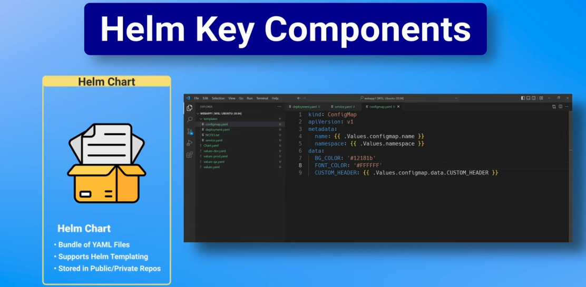
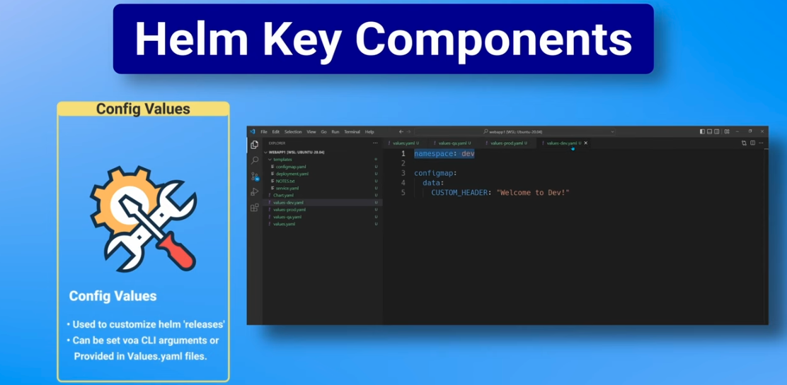
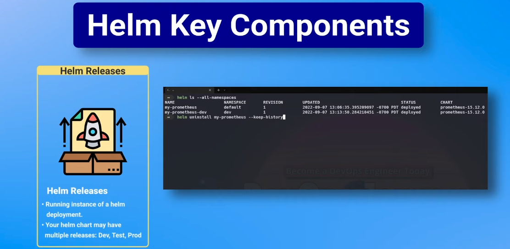
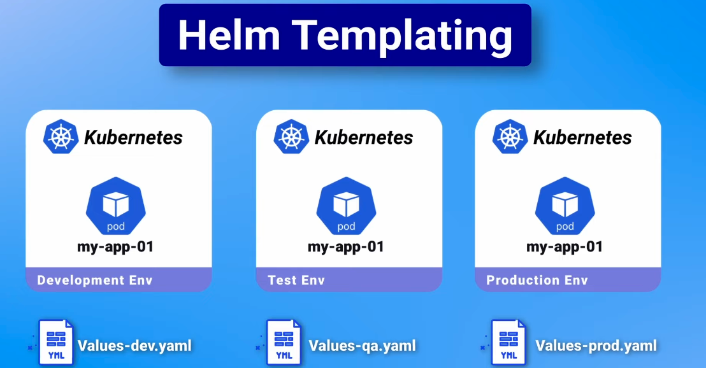
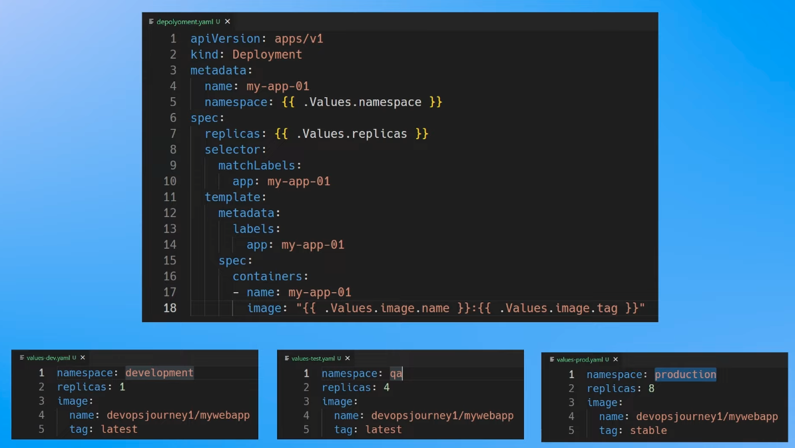
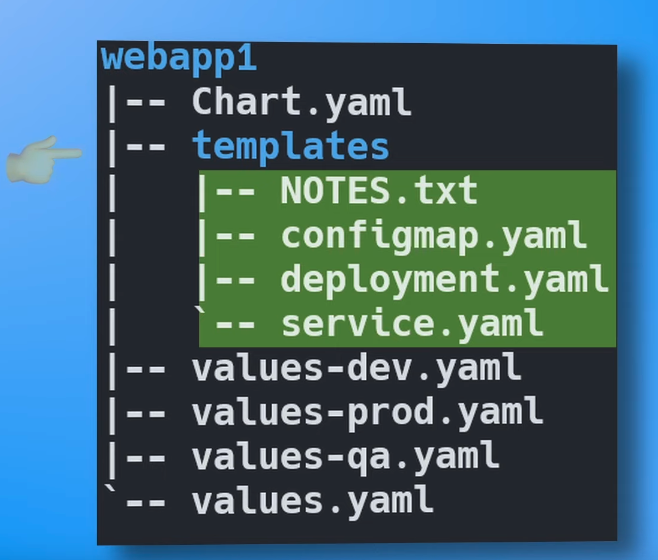
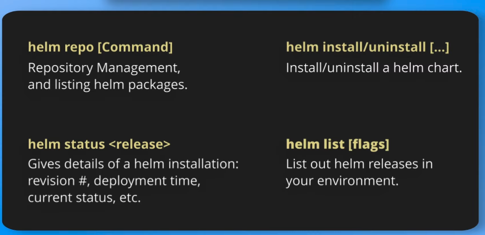

## What is Helm
- Package Manager for K8
- You can install, update, rollback K8 deployments
- Say that you want to install Prometheus into K8. It has lots of components like Pushgateway, Alertmanager and etc. If you want to
deploy iy by own you need to define lots of manifest file. Instead helm has helm charts published in artifactory so you can use it.

## Helm Components
There are three concepts

***Helm Charts***

***Config Values***

***Helm Releases***

## HelmChart Structure

- There can be public and private repositories using Helm. One of most known public repository is artifacthub
- Most important features of Helm is templating engine. It allows you to customize Helm releases. This feature is very similar what Kustomize does
- There is a blueprint and the different values yaml files for each environment

Folder Structure ->

***Helm v2 vs Helm v3***
- Helm v2 depends on the Tiller Service while Helm v3 can talk directly to K8 api

## Helm CLI

***Installing Prometheus***

You can find the urls in artifacthub web site

- `helm search hub prometheus`
- `helm repo add <url>`
- `helm repo ls` 
- `helm install <url>` --namespace=<your-namespace>
- `helm ls --all-namespaces` -> list all helm releases
- `helm show values <config>` -> the config parameter is in the charts documentation. This command outputs all the values you can configure in helm chart