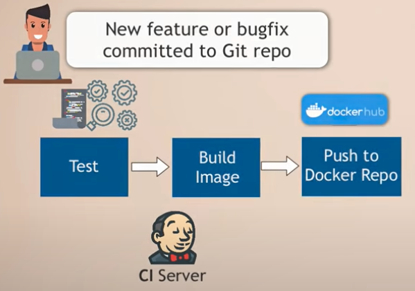
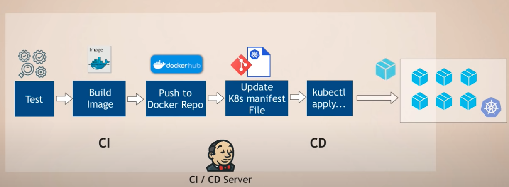
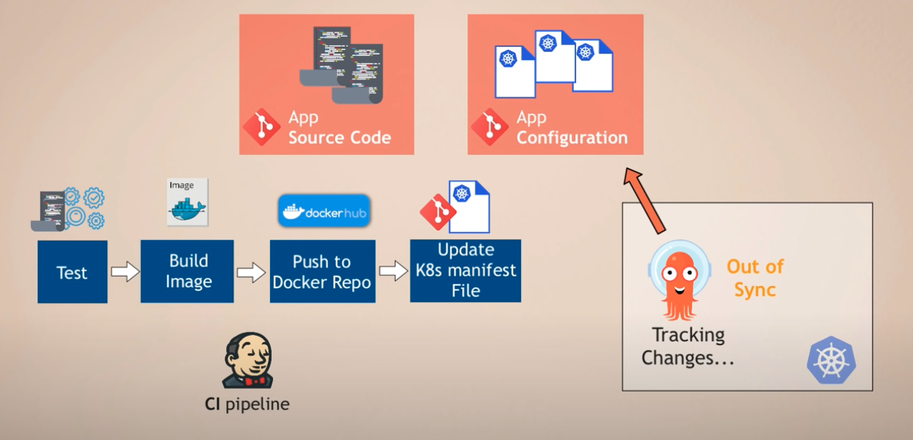
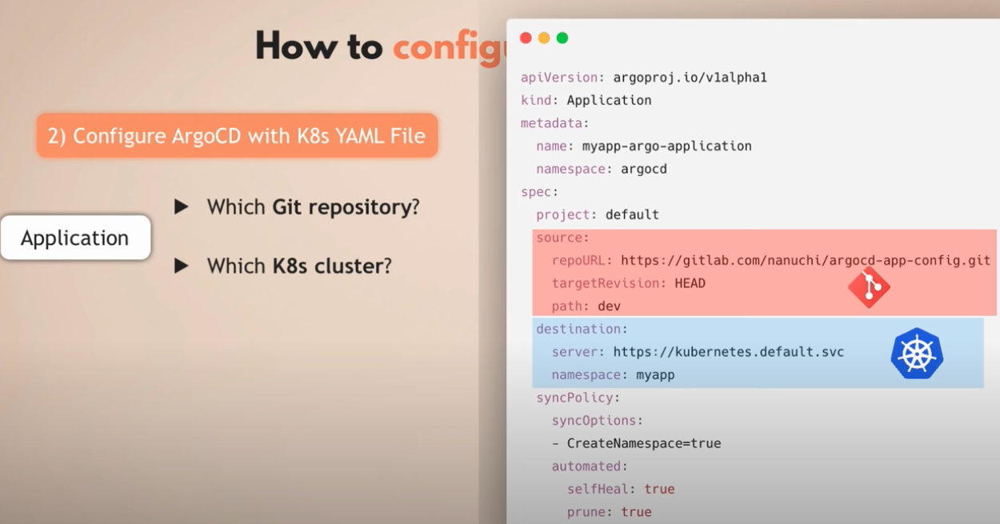

* Argo CD is a continuos delivery tool

Let's understand the situation

* When a code committed to a git repo the CI pipeline will be triggered. The test cases will be run, a new image will be build and a new container will be pushed to docker repo.

The question is how does this image get deployed to K8 cluster?
- Update K8s deployment file with new image tag
- Apply changes to K8

The last step is CD step can be handled by Jenkins

There are challenges with this approach
- Install and setup tools like kubectl
- Configure access to K8s
- Security challenge
The most important one is there is no visibility of deployment status. When a kubectl apply triggered by Jenkins, it is not capable of
see the status of the deployment

CD part can be improved. This why ArgoCD was built
- ArgoCD is part of K8s cluster
- ArgoCD agent pulls K8s manifest changes and applies them

- When a code committed to a git repo, ArgoCD watches the changes and compares the actual state and the desired state.

Overall the Benefits
- Single interface
- Version controlled changes
- History of changes

ArgoCD is based on GitOps and helps implement those GitOps principles

## ArgoCD as a K8s Extension
- ArgoCD uses existing K8s functionalities
- Using etcd to store data
- Using K8s controllers for monitoring adn comparing actual and desired state

Benefit of that is the visibility in the cluster which Jenkins doesn't have

## How to configure ArgoCD
- Extends the K8s API with CRD
- Deploy ArgoCD in the K8s cluster
- Configure ArgoCD with K8s yaml file
- Main resource is Application

